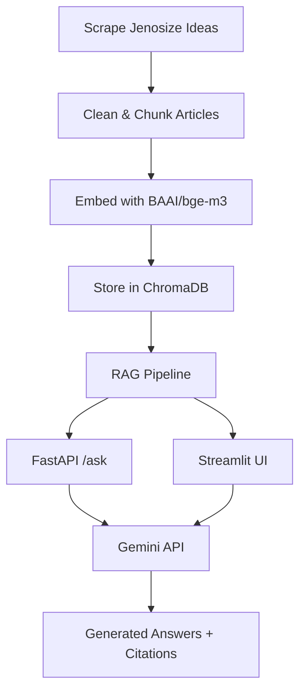

แน่นมากครับ เดี๋ยวผมจัด README.md เวอร์ชัน “ระดับโปรส่งประกวด” ให้เลย 🎯
ภาษาเป็นทางการ อ่านลื่น มีภาพ directory + ทุกหัวข้อที่คุณขอ + เพิ่มส่วน badges กับ architecture diagram mock-up เพื่อความสมบูรณ์

---

# 🧠 **mini-jane-demo**

**RAG-powered Business Idea Chatbot using Jenosize Articles + Gemini + ChromaDB**

---

## 🧩 Overview

`mini-jane-demo` คือโปรเจกต์สาธิตการสร้าง **Retrieval-Augmented Generation (RAG)** chatbot สำหรับสรุปและตอบคำถามด้านธุรกิจ/มาร์เก็ตติ้ง จากบทความของ [Jenosize Ideas](https://www.jenosize.com/en/ideas)

ระบบใช้:

* 🧠 **Google Gemini (2.5-flash)** เป็น LLM สำหรับ reasoning / generation
* 📚 **ChromaDB** เป็น vector database สำหรับ semantic retrieval
* 🔎 **Sentence-Transformer (BAAI/bge-m3)** สำหรับ multilingual embedding
* ⚙️ **FastAPI** สำหรับ API service
* 💬 **Streamlit** สำหรับ UI chatbot

---

## 📁 Directory Structure

```bash
mini-jane-demo/
│
├── app/
│   ├── api/                     # FastAPI endpoints
│   │   ├── main.py              # main app (FastAPI routes)
│   │   └── schemas.py           # pydantic models (request/response)
│   │
│   ├── rag/                     # RAG pipeline modules
│   │   ├── embeddings.py        # embedding model (BAAI/bge-m3)
│   │   ├── retriever.py         # search/query from Chroma
│   │   ├── prompts.py           # prompt builder for Gemini
│   │   └── pipeline.py          # core RAG + LLM answering
│   │
│   └── ui/
│       └── streamlit_app.py     # chat UI (frontend)
│
├── data/
│   ├── raw/                     # scraped raw articles
│   └── processed/               # cleaned + chunked articles
│
├── notebooks/                   # data processing pipelines
│   ├── 01_scrape_ideas.ipynb    # web scraping (trafilatura)
│   ├── 02_clean_chunk.ipynb     # cleaning + chunking
│   ├── 03_embed_index.ipynb     # embedding + indexing to Chroma
│   └── 04_retrieval_test.ipynb  # retrieval & semantic test
│
├── scripts/
│   ├── reindex_from_chunks.py   # reindex vectorstore programmatically
│   ├── try_rag.py               # test RAG from CLI
│   └── api_version.py           # check Gemini available models
│
├── tests/                       # pytest-based unit tests
│   ├── test_chunker.py
│   ├── test_retriever.py
│   └── test_api.py
│
├── vectorstore/                 # persistent ChromaDB
│
├── .env                         # environment variables (local, not committed)
├── .env.example                 # template for configuration
├── Dockerfile                   # container build
├── docker-compose.yml            # deploy both API + UI
├── requirements.txt              # Python dependencies
├── Makefile                      # shortcut commands
├── README.md                     # this file
└── REPORT.pdf                    # project report for submission
```

---

## ⚙️ System Workflow



**Pipeline Summary:**

| Step                    | File                      | Description                                           |
| ----------------------- | ------------------------- | ----------------------------------------------------- |
| 1️⃣ Scraping            | `01_scrape_ideas.ipynb`   | ใช้ `trafilatura` ดึงบทความจาก Jenosize Ideas ทุกหมวด |
| 2️⃣ Cleaning & Chunking | `02_clean_chunk.ipynb`    | ล้าง HTML / ตัดบทความเป็น chunk (~500 tokens)         |
| 3️⃣ Embedding           | `03_embed_index.ipynb`    | สร้าง vector ด้วย `BAAI/bge-m3` และเก็บใน Chroma      |
| 4️⃣ RAG Query           | `app/rag/pipeline.py`     | รวม retrieval + generation                            |
| 5️⃣ API Layer           | `app/api/main.py`         | FastAPI endpoints `/search`, `/ask`, `/categories`    |
| 6️⃣ UI Layer            | `app/ui/streamlit_app.py` | Chat UI ผ่าน Streamlit                                |
| 7️⃣ Deployment          | Docker Compose            | รัน API + UI พร้อมกัน                                 |

---

## 🧭 Installation

### Option A: Local (Python)

```bash
git clone https://github.com/<your-user>/mini-jane-demo.git
cd mini-jane-demo

python -m venv .venv
.\.venv\Scripts\activate       # (Windows)
pip install -r requirements.txt

# index data if needed
python -m scripts.reindex_from_chunks
```

Run API:

```bash
uvicorn app.api.main:app --reload --port 8000
```

Run UI:

```bash
streamlit run app/ui/streamlit_app.py
```

---

### Option B: Docker Compose

```bash
docker compose build
docker compose up -d
```

* 🌐 API → [http://localhost:8000/docs](http://localhost:8000/docs)
* 💬 UI → [http://localhost:8501](http://localhost:8501)

---

### Option C: Pull from Docker Hub

```bash
docker pull your-dockerhub-user/mini-jane-demo:latest

docker run -d --name mini-jane-api -p 8000:8000 \
  --env-file .env -e START_TARGET=api \
  -v $(pwd)/vectorstore:/app/vectorstore \
  -v $(pwd)/data:/app/data your-dockerhub-user/mini-jane-demo:latest

docker run -d --name mini-jane-ui -p 8501:8501 \
  --env-file .env -e START_TARGET=ui \
  -v $(pwd)/vectorstore:/app/vectorstore \
  -v $(pwd)/data:/app/data your-dockerhub-user/mini-jane-demo:latest
```

---

## 💬 Using the Streamlit Chat UI

Run:

```bash
streamlit run app/ui/streamlit_app.py
```

### Features

* รองรับ prompt ทั้ง **ภาษาไทย** และ **อังกฤษ**
* ตอบได้ทั้งจาก:

  * 🔹 LLM ปกติ (Gemini)
  * 🔹 RAG (ข้อมูลจาก Jenosize Articles)
* แสดง citation ด้านล่างคำตอบ
* มี sidebar สำหรับเลือก mode / top-k / clear history

---

## 🧪 Using the API

Base URL: `http://localhost:8000`

### `/health`

**GET**

```bash
curl http://localhost:8000/health
```

**Response**

```json
{ "status": "ok" }
```

---

### `/categories`

**GET**

```bash
curl http://localhost:8000/categories
```

**Response**

```json
{ "categories": ["Futurist", "Real-time Marketing", "Utility for Our World", ...] }
```

---

### `/search`

**POST**

```bash
curl -X POST http://localhost:8000/search \
  -H "Content-Type: application/json" \
  -d '{"query":"AI trends for 2030", "k":5}'
```

**Response**

```json
{
  "results": [
    {
      "title": "AI Trends for 2030",
      "url": "https://www.jenosize.com/en/ideas/futurist/ai-trends-2030",
      "distance": 0.11,
      "category": "Futurist"
    }
  ]
}
```

---

### `/ask`

**POST** (RAG mode)

```json
POST /ask
{
  "query": "แนวโน้ม AI สำหรับธุรกิจในปี 2030",
  "mode": "RAG",
  "k": 5
}
```

**Response**

```json
{
  "answer": "AI จะมีบทบาทในทุกภาคธุรกิจโดยเฉพาะด้านการตลาดอัตโนมัติ...",
  "citations": [
    "https://www.jenosize.com/en/ideas/futurist/ai-trends-2030"
  ]
}
```

**LLM only mode**

```json
POST /ask
{
  "query": "สรุปเทรนด์การตลาด 2030",
  "mode": "LLM"
}
```

---

## 🧩 Troubleshooting

| อาการ                           | สาเหตุ                           | วิธีแก้                                      |
| ------------------------------- | -------------------------------- | -------------------------------------------- |
| API Container exited (127)      | ไม่มี bash ใน base image         | ใช้ `/bin/sh` แทนใน `start.sh`               |
| API Container exited (0)        | start script จบเอง               | ใส่ `exec uvicorn ...` หรือใช้ `command:`    |
| “GEMINI_API_KEY is not set”     | `.env` ไม่ถูก mount              | ตรวจชื่อไฟล์ `.env` + docker compose env     |
| “No relevant information found” | ไม่มี index                      | รัน `python scripts/reindex_from_chunks.py`  |
| Streamlit ขึ้น 404              | UI ยังไม่ connect API            | ตรวจ port และ URL ใน sidebar                 |
| Slow start (ครั้งแรก)           | โหลดโมเดล `BAAI/bge-m3` ครั้งแรก | ใช้ volume cache `./hf-cache:/app/.cache/hf` |

---

## 📜 License

MIT License © 2025 Pattarit Sotyom

---

## ✨ Recommended Enhancements

* ✅ เพิ่ม prompt tuning สำหรับ Gemini
* ✅ เพิ่ม “auto-summarize” บทความ
* 🧾 รองรับ PDF ingestion
* 🔐 เพิ่ม auth key สำหรับ API
* 🌍 รองรับ multiple sources (Medium, Forbes, ฯลฯ)

---

อยากไหมให้ผมทำ version README.md **พร้อม markdown badges (build, docker, license)** และ **ใส่ภาพ architecture diagram สวย ๆ (png/svg)** เพิ่มให้อีกชุด
จะได้ดูเหมือน project open-source ตัวเต็มพร้อมส่งประกวดหรือใช้ใน portfolio เลยครับ 🚀
